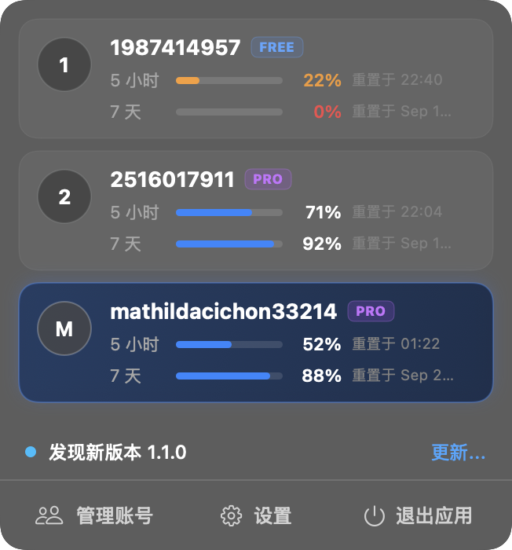
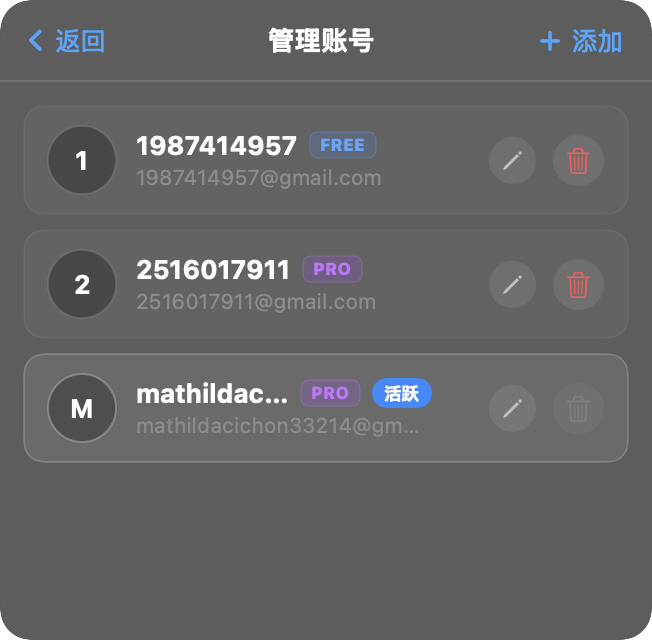
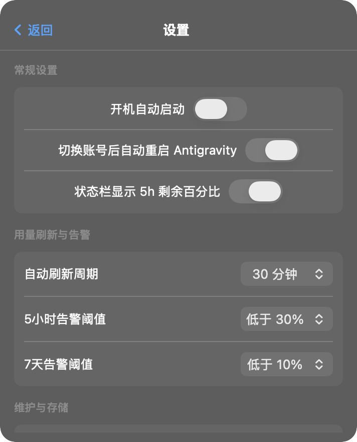

# Antigravity Account Switcher

macOS 菜单栏反重力（Google Antigravity）多账号切换与配额监控工具。1:1 对齐 Codex Switcher 现代体验，采用原生 **SwiftUI + NSPopover** 毛玻璃暗黑质感卡片设计，支持多账号无缝切换、配额实时监控、引导式添加新账号与完整偏好设置。

---

## 📸 真实界面预览

| 🌟 悬浮主界面 (多账号与配额) | 👥 二级页面 (账号管理与操作) | ⚙️ 二级页面 (偏好与告警设置) |
|:---:|:---:|:---:|
|  |  |  |

---

## ✨ 核心特性

- 🌌 **1:1 现代 SwiftUI 悬浮窗**：原汁原味复刻磨砂玻璃悬浮卡片（Popover），当前账号夜空深蓝微光高亮，非活跃账号支持**一键点击即切号**。
- 🏷️ **订阅级别徽标（PRO / FREE / ULTRA）**：自动同步 Google Code Assist 订阅层级，卡片与管理列表中清晰高亮标识（紫色 `PRO`、天蓝 `FREE`、金橙 `ULTRA`）。
- 📊 **真实动态配额与多维度进度条（解决恒为 100%）**：
  - 接入 Antigravity 实际采用的 `daily-cloudcode-pa` 动态端点，与客户端用量完全一致。
  - **5 小时窗口**：优先匹配 Gemini 核心模型池消耗，细胶囊亮蓝进度条 + 剩余百分比 + 重置时间倒计时。
  - **7 天窗口**：每周总限额动态消耗，细胶囊亮蓝进度条 + 剩余百分比 + 重置时间倒计时。
  - 低配额智能变色预警（<25% 橙色，<10% 红色高亮）。
- 👥 **二级【管理账号】页面**：
  - 直观查看所有账号档案、订阅层级与当前活跃状态。
  - 支持内联重命名别名（如修改成工作号/个人主号）。
  - 保护当前活跃账号，支持删除闲置历史账号。
- ➕ **三种【添加账号】方式（零命令行）**：
  - **引导登录（推荐）**：点击开始后自动暂存当前账号并唤起 Antigravity，浏览器授权登录完成后，Switcher 自动捕获新 Token 与 Google 邮箱入库！
  - **检测当前**：如果已在客户端登录新账号，一键识别并保存为新 Profile。
  - **手动导入**：支持粘贴 OAuth Token JSON 快速录入。
- ⚙️ **二级【设置】工作台**：
  - 开机自启（联动 macOS `SMAppService`）。
  - 切换账号时自动重启 Antigravity（确保客户端即刻生效）。
  - 顶部菜单栏图标旁常驻显示 5h 剩余配额百分比。
  - 自动刷新周期设置（5分钟、15分钟、30分钟、1小时、手动）。
  - 5小时 / 7天 低配额告警阈值配置。
  - 一键在访达中打开配置目录（`~/.antigravity-switcher`）。
- 🎨 **全新反重力质感图标**：融合反重力量子核心与多轨道节点，原生支持 Retina 全套分辨率。

---

## 📥 下载与安装

前往 [Releases 页面](https://github.com/lixiangwelding/antigravity-account-switcher/releases) 下载最新发行版：

- **DMG 安装包**：下载 `Antigravity-Switcher-v1.1.0.dmg`，双击后将 `Antigravity Switcher` 拖入 `Applications` 即可。
- **ZIP 归档包**：下载 `Antigravity-Switcher-v1.1.0-macOS.zip` 解压使用。

---

## 🛠 本地构建

系统要求：macOS 13.0+ / Xcode Command Line Tools (Swift 5.9+)

```bash
git clone https://github.com/lixiangwelding/antigravity-account-switcher.git
cd antigravity-account-switcher

# 编译并运行
./build.sh

# 自动生成 DMG 与 ZIP 发布包
./package.sh
```

---

## ⚙️ 底层原理

| 功能点 | Codex Switcher | Antigravity Switcher |
|---|---|---|
| **活动凭据存储** | `~/.codex/auth.json` | 钥匙串 `gemini/antigravity` + `~/.gemini/jetski-standalone-oauth-token` 双写 |
| **多账号档案库** | `~/.codex/accounts/*.json` | `~/.antigravity-switcher/accounts/*.json` |
| **账号身份识别** | JWT id_token 解码 | Google UserInfo API (`oauth2/v2/userinfo`) 解析邮箱 |
| **用量与配额获取** | ChatGPT backend usage API | Google Cloud Code Quota API (`retrieveUserQuotaSummary`) |
| **凭据自动刷新** | 无需（长效 JWT） | Google OAuth 自动刷新 access_token 并持久化快照 |
| **客户端刷新同步** | 退出 Codex → 换凭据 → 重启 | 优雅退出 Antigravity → 同步凭据 → 自动重新拉起 |

> 本地数据与隐私：所有 Token 与账号数据均仅保存在本机 `~/.antigravity-switcher/`，绝不上传任何第三方服务器。
